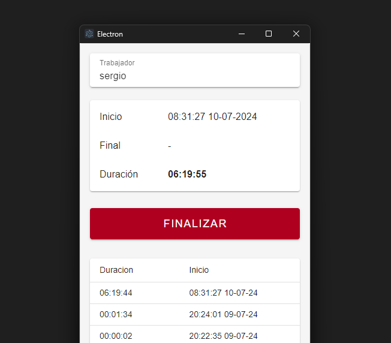

# Electron Vue Horas
Una aplicación nativa creada con VueJS y portada mediante Electron.

La aplicación sirve para llevar un registro de horas de trabajadores que se gestiona en un servidor externo.

## Stack
    - VueJS
    - Vite
    - Electron
    - Vuetify

